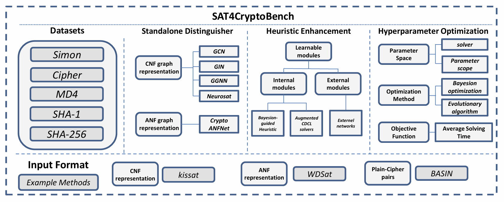

<div align="center">
    <h1> <a>SAT4CryptoBench</a></h1>
  <p align="center" style="font-size: 30px">
    <a href="https://openreview.net/pdf?id=BmwbEWRkyE">📃Paper</a> • 
    <a href="https://www.kaggle.com/datasets/35ed67ea30fb819f1dbd3b1cbae9c0cb2fd401e6ad7c181497ac2e5cf88d0823">📊Data</a> • 
    <a href="#-citation">📖Citation
  </p>
</div>     
        
---
        


## 🏃 Intro

**SAT4CryptoBench** is a large-scale benchmark designed for evaluating **SAT-based cryptographic problem-solving**.  
It provides a standardized dataset and experimental framework for analyzing solver performance, instance hardness, and model generalization across different cryptographic primitives.  

This benchmark aims to bridge the gap between **AI-enhanced SAT solving** and **traditional cryptanalysis**, enabling systematic comparisons and training data for **neural-guided solvers**.

## 💡 Contribution
- 🧩 Establishes the **first unified SAT benchmark** for cryptographic problem-solving tasks.  
- 🧠 Provides **ANF-to-SAT instance transformation pipelines** with full variable mapping and labeling.  
- ⚙️ Integrates **solver-agnostic evaluation framework** for both classical and neural SAT solvers.  
- 📊 Includes **difficulty ranking and solver diagnostics** for interpretability and analysis.  
- 🔍 Enables **learning-based optimization** for SAT variable decision, restart, and clause pruning strategies.

## ⚡ Requirements
- python 3.8  
- torch  
- torch_geometric==2.6.1  
- torch_spline_conv==1.2.2  
- torch_sparse==0.6.18  
- torch_scatter==2.1.2  
- torch_cluster==1.6.3  
- pyg_lib==0.4.0  

## 📁 Benchmarks

- **Cipher**: Contains the Cipher dataset in CNF format, covering 8 to 12 encryption rounds. Each configuration currently includes 1000 samples.
- **Simon**: Provides the Simon dataset in CNF format, covering 10 to 12 rounds with a 32-bit key. Each configuration currently contains 1000 samples.
- **md4-20rounds**: Includes the MD4 dataset in CNF format with 20 rounds. Currently provides 1000 samples.
- **sha1-21rounds**: Contains the SHA-1 dataset in CNF format with 21 rounds. Currently includes 1000 samples.
- **sha256-18rounds**: Features the SHA-256 dataset in CNF format with 18 rounds. Currently includes 1000 samples.
- **Simon-ANF**: Offers the Simon dataset in ANF format, covering 10 to 12 rounds with a 32-bit key. Each configuration includes 1000 samples.

## 💻 Evaluation

### 🧩 1. Standalone Solver

#### 🧠 Model Training

```shell
python train_model.py satisfiability ./simon-12-32-64/anf/train \
  --train_splits sat unsat \
  --valid_dir ./simon-12-32-64/anf/valid \
  --valid_splits sat unsat \
  --label satisfiability --graph anf --model cryptoanfnet \
  --n_iterations 32 --lr 1e-4 --weight_decay 1e-8 \
  --scheduler CosineAnnealingLR --batch_size 8 --seed 123 --epochs 100
```

#### 🧪 Evaluation

```shell
python eval_model.py satisfiability ./simon-12-32-64/anf/test <path_to_ckpt> \
  --test_splits sat unsat \
  --label satisfiability --graph anf --model cryptoanfnet \
  --n_iterations 32 --batch_size 512
```

------

### ⚡ 2. Heuristic Enhancement

#### 🧰 Setup

Compile solvers before testing, e.g.:

```shell
cd kissat
./configure && make
```

#### 🚀 Run Evaluation

```shell
python test_solver.py
```

##### Parameters

```
EXPERIMENT_NUM = 7   # Dataset index (0–10)
SOLVER_NUM = 0       # Solver index (0–11)
execution_path = './kissat/build/kissat'
```

##### Available Solvers

```
['kissat', 'MaplePainless', 'CDCL-Crypto', 'Maplesat',
 'glucose-4.1-bmm', 'maplecomsps_lrb_vsids_18-bmm',
 'maplelcmdistchronobt-bmm', 'maplesat-bmm', 'glucose-4.1',
 'maplecomsps_lrb_vsids_18', 'maplelcmdistchronobt', 'cadical']
```

##### Dataset Options

```
['cipher-8','cipher-9','cipher-10','cipher-11','cipher-12',
 'simon-10-32-64','simon-11-32-64','simon-12-32-64',
 'md4-20rounds','sha1-21rounds','sha256-18rounds']
```

- Timeout: `5000s` per instance
- Logs: `./logs/<solver_name>/<dataset>.log`
- Multi-threaded via `ThreadPoolExecutor (max_workers=5)`

------

### 🔧 3. Hyperparameter Optimization (HPO)

#### EasyNAS

##### Run Command

```shell
export PYTHONPATH=$PYTHONPATH:<path/to/EasyNAS>
cd <path/to/EasyNAS>
python app/run_engine.py --cfg configs/hpo_kissat.yaml
```

##### YAML Example

```yaml
engine:
  submodule_name: engines.BashEngine
  args:
    bash_cmd: "cd <path/to/EasyNAS> && bash test_cnf.sh"
    eval_names: ['time']
```

- `bash_cmd`: solver test command
- `eval_names`: runtime metric for optimization

Logs and results are saved under `root_path`.

#### HEBO

```shell
python hebo_optim_<solver>.py
```

Examples:

```shell
python hebo_optim_kissat.py
python hebo_optim_maplesat.py
python hebo_optim_cryptosat.py
```

## 📧 Contributing
This project is released under the Apache 2.0 license. Please see the [LICENSE](./LICENSE) file for more information.

Feel free to discuss the paper/data/code with us through issues/emails!
## 📖 Citation

If you find our work helpful, please consider starring ⭐ us and citing:

```{bibtex}
@inproceedings{Zheng25sat4cryptobench,
      title={Bridging Crypto with ML-based Solvers: the SAT Formulation and Benchmarks}, 
      author={Xinhao Zheng, Xinhao Song, Bolin Qiu, Yang Li, Zhongteng Gui, Junchi Yan},
      year={2025},
      booktitle = {Advances in Neural Information Processing Systems},
      url={https://openreview.net/pdf?id=BmwbEWRkyE}, 
}
```
